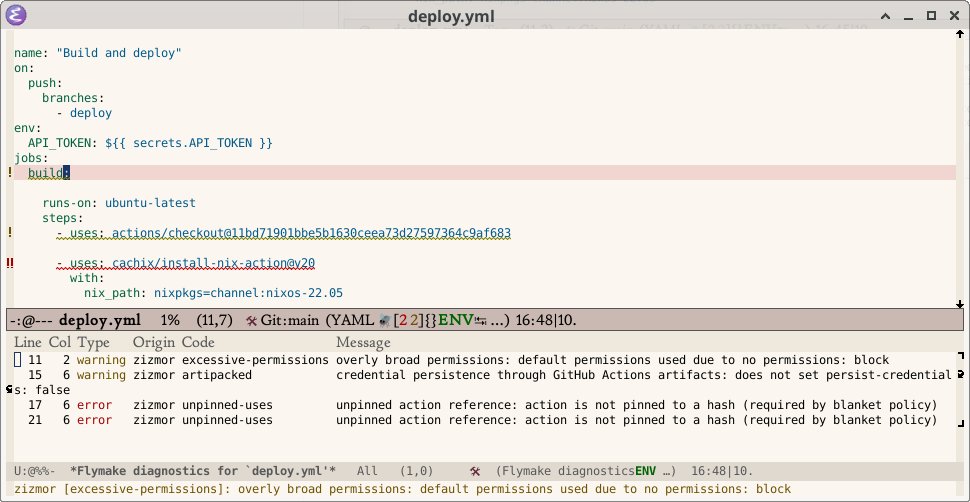

* flymake backend for zizmor

Setup:

#+begin_src emacs-lisp
(use-package yaml-ts-mode
  :defer t
  :mode (("\\.yml\\'" . yaml-ts-mode)
         ("\\.yaml\\'" . yaml-ts-mode))
  :hook ((yaml-ts-mode . flymake-mode)))

(use-package flymake-zizmor
  :load-path "~/path/to/checkout/of/flymake-zizmor"
  :defer t
  :hook (yaml-ts-mode . flymake-zizmor-setup))
#+end_src

Make sure you've installed =zizmor= (see https://zizmor.sh/ for how).
Ensure it is in =PATH=, or set =flymake-zizmor-program= to the full
path to it.

